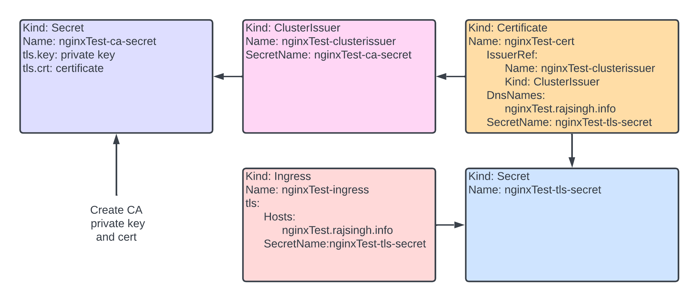

# Leveraging Cert-Manager for Self-Signed Certificates in Kubernetes

## Introduction
This tutorial covers an integral aspect of web-based applications and services - secure and encrypted communication through the use of certificates. We focus on leveraging Cert-Manager, a native Kubernetes tool, for managing self-signed certificates within a Kubernetes environment.

Cert-Manager significantly simplifies the process of obtaining, renewing, and using certificates by automating these steps, thus minimizing the risk associated with manual certificate management.

To handle incoming requests and route traffic, we'll utilize the NGINX Ingress Controller. NGINX, a highly performant web server, has been widely adopted due to its stability, simplicity, and robust feature set. When deployed as a Kubernetes ingress controller, NGINX accepts incoming requests and directs them to the appropriate services within the cluster based on the routing rules defined.

The flow of the tutorial is as follows:

1. We start by creating a Certificate Authority (CA) with OpenSSL.
2. The generated certificate and key content are then converted to base64 for easier handling.
3. Following that, we create a secret object in Kubernetes to store the certificate and key.
4. A Cluster Issuer object is created next, which is responsible for issuing certificates.
5. We then generate a new certificate for our services.
6. A TLS reference is added to our NGINX ingress to ensure secure connections.
7. Lastly, we apply all changes to our Kubernetes cluster.

This tutorial repository includes YAML configuration files for each step in the process. These can be used as a reference, or directly applied to your Kubernetes cluster, allowing you to deploy and manage self-signed certificates with ease.

## Architecture Diagram


## Prerequisites

Before proceeding with the steps, ensure that you meet the following prerequisites:

- **Kubernetes Cluster:** You should have a running [Kubernetes](https://kubernetes.io/docs/home/) cluster.
- **Kubectl:** The Kubernetes command-line tool, [kubectl](https://kubernetes.io/docs/reference/kubectl/), should be installed and configured to interact with your cluster.
- **OpenSSL:** [OpenSSL](https://www.openssl.org/docs/) tool should be installed in your local environment for certificate generation.
- **Cert-Manager:** You should install [Cert-Manager](https://cert-manager.io/docs/) in your Kubernetes cluster.
- **NGINX Ingress Controller:** [NGINX](https://kubernetes.github.io/ingress-nginx/), a high-performance web server, should be installed as your Kubernetes ingress controller.

## Steps

1. Create a Certificate Authority
    a. Create a CA private key
    ```bash
    openssl genrsa -out ca.key 4096
    ```
    Generate a CA private key
    b. Create a CA certificate
    ```bash
    openssl req -new -x509 -sha256 -days 365 -key ca.key -out ca.crt
    ```
    c. Import the CA certificate in the `trusted Root Ca store` of your clients
2. Convert the content of the key and crt to base64 oneline
    ```bash
    cat ca.crt | base64 -w 0
    cat ca.key | base64 -w 0
    ```
3. Create a secret object `nginxTest-ca-secret.yml` and put in the key and crt content
4. Create a cluster issuer object `nginxTest-clusterissuer.yml`
5. Create a new certificate `nginxTest-cert.yml` for your projects
6. Add a `tls` reference in your ingress `nginxTest-ingress.yml`
7. Apply all changes
